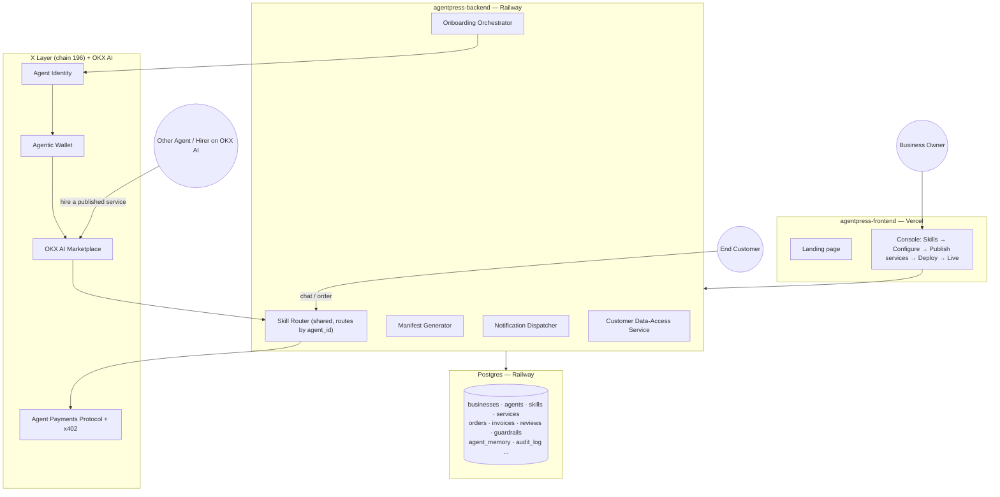

# AgentPress

**A no-code console for building and deploying AI agents for small businesses on X Layer, listed on the OKX AI Marketplace.**

OKX AI opened an economy where agents hire agents and get paid in stablecoins — but its real onboarding requires installing a coding agent (Claude Code, Codex, OpenClaw, or Hermes) and pasting the right prompts into it. Fine for a developer. A wall for the person running a jollof rice business out of her kitchen in Lagos.

AgentPress turns that wall into a form: pick your skills, set your price, hit deploy. Five minutes, no code — and that business has an AI agent taking orders, sending invoices, and optionally earning on OKX AI while its owner sleeps.

This isn't a competing marketplace. OKX AI already owns discovery, identity, and reputation — AgentPress is the no-code layer in front of it, making its addressable market an order of magnitude bigger than "people who run Claude Code."

---

## Table of contents

- [Architecture](#architecture)
- [Features](#features)
- [Tech stack](#tech-stack)
- [Repository structure](#repository-structure)
- [Data model](#data-model)
- [API reference](#api-reference)
- [Deployment](#deployment)
- [What's real vs. mocked](#whats-real-vs-mocked)
- [Grounded in OKX's actual docs](#grounded-in-okxs-actual-docs)
- [Roadmap](#roadmap)
- [Sources](#sources)

---

## Architecture

Four layers, split across two deployable repos:



**Frontend** (`agentpress-frontend`) is the console a business owner actually uses: pick skills, configure guardrails, optionally publish any skill as a priced OKX AI service, review the manifest, deploy. Talks to the backend over plain REST — no direct database or chain access.

**Backend** (`agentpress-backend`) owns the Postgres schema and does the real work: a shared Skill Router that handles every deployed agent's incoming messages by `agent_id` (one process, not one-per-agent — deliberately simple for this stage), an Onboarding Orchestrator that drives identity/wallet/registration/listing as a trackable checklist, and a Manifest Generator that turns an agent's skills/services/guardrails into the JSON OKX AI actually reads.

**Postgres** is the single source of truth — encrypted PII at the application layer, everything genuinely deletable (a deliberate choice over ledger-style permanent storage like Arweave, since customer data needs to support real deletion requests).

**X Layer + OKX AI** is external, called through the (currently mocked) integration points described below.

## Features

**Skills** — toggleable capabilities, either built-in or published as public services:

| Skill | Category | Escrow | Pricing |
|---|---|---|---|
| Order Taking | Sales | No | per order |
| Invoicing & Collection | Finance | Yes | per invoice |
| Customer Support | Sales | No | metered |
| Bookkeeping | Finance | No | included |
| Scheduling | Operations | No | per booking |
| Supplier Ordering | Operations | Yes | per order |
| Marketing | Growth | No | included |
| Reputation & Reviews | Trust | No | included |

**Templates** — starter bundles of skills/services/guardrails: Customer Support Agent, Finance & Invoicing Agent, Sales & Lead Agent, Token Research Agent, Smart Contract Auditor Agent.

**Guardrails** — per-agent spend limits and an approval threshold, enforced by the Skill Router before any money-moving skill executes.

**Publish-as-service bridge** — the mechanism connecting what an agent does privately for its owner to what it sells publicly. Any skill can be turned into a priced OKX AI listing: flat price, no negotiation (A2MCP) by default. This is the actual WordPress-plugin-style idea behind AgentPress — skills are the private capability, services are the public listing.

**Customer data access** — a magic-link flow (no login) letting a business's own customers view, export, or delete what an agent remembers about them.

## Tech stack

| Layer | Technology |
|---|---|
| Frontend | Next.js 14 (App Router), Tailwind CSS, lucide-react |
| Backend | Node.js, Express |
| Database | PostgreSQL |
| Chain | X Layer (chain ID 196) |
| Identity/Payments | OKX Agent Identity, Agentic Wallet, Agent Payments Protocol, x402 |
| Hosting | Vercel (frontend), Railway (backend + Postgres) |

## Repository structure

```
agentpress-frontend/     Next.js console + landing page → deploy to Vercel
agentpress-backend/      Express API + Postgres schema  → deploy to Railway
agentpress-landing/      Standalone static landing page (reference only)
```

`agentpress-frontend` and `agentpress-backend` deploy as **two separate GitHub repos** — Vercel and Railway each build from their own. Splitting them is expected, not a packaging error.

## Data model

| Table | Purpose |
|---|---|
| `businesses` | The small business account |
| `agents` | One deployed agent per business; carries identity/wallet/registry fields once live |
| `templates` | Starter bundles of skills/services/guardrails |
| `skills` | Master catalog of the 8 built-in skills |
| `agent_skills` | Which skills are active per agent, with their config |
| `services` | Public OKX AI listings — the publish-as-service bridge, links back to `skills` via `source_skill_id` |
| `reviews` | Star ratings/review counts per service |
| `guardrails` | Per-agent spend limits and approval threshold |
| `onboarding_steps` | Step-by-step deploy checklist state |
| `agent_manifests` | Versioned generated manifest JSON |
| `customers` | A business's own end customers |
| `orders` | Order Taking skill's tickets |
| `invoices` | Invoicing skill's escrow/payment lifecycle |
| `escrow_events` | Quote/escrow/settlement/dispute audit trail |
| `agent_memory` | Centralized, encrypted, deletable agent memory |
| `customer_data_requests` | Magic-link view/export/delete requests |
| `notifications` | Admin "notify me" log |
| `audit_log` | Explainability trail for every agent action |

Full DDL: `agentpress-backend/agentpress-backend-schema.sql`.

## API reference

All routes live in `agentpress-backend`.

**Console — build phase, before deploy**
- `GET /skills` — master skill catalog
- `POST /businesses`, `POST /agents` — create the draft business + agent
- `PATCH /agents/:id` — update name/description
- `GET /agents/:id` — full detail (agent + active skills + guardrails)
- `PUT /agents/:id/skills` — replace the active skill set + config
- `PUT /agents/:id/guardrails` — upsert spend limits / approval threshold

**Publish-as-service bridge**
- `POST /agents/:id/services` — create a service from a skill (defaults `service_type: 'A2MCP'`)
- `GET /agents/:id/services` — list services with rating summary
- `POST /services/:id/publish` — list a service on OKX AI (mocked)
- `GET /services/:id/reviews` — read reviews for a service

**Deploy**
- `POST /agents/:id/deploy` — runs the full onboarding checklist
- `GET /agents/:id/onboarding` — step-by-step status
- `POST` / `GET /agents/:id/manifest` — regenerate / fetch the latest manifest

**Runtime**
- `POST /webhook/message` — incoming customer message, routed by `agent_id`
- `GET /agents/:id/orders` — orders for the Live dashboard
- `POST /orders/:id/fulfill` — mark an order fulfilled; releases escrow if applicable
- `POST /data-requests`, `GET /my-data/:token` — customer self-service data access

## Deployment

1. **Database** — create a Postgres instance on Railway, run `agentpress-backend/agentpress-backend-schema.sql` against it.
2. **Backend** — push `agentpress-backend/` to its own GitHub repo, deploy to Railway, set `DATABASE_URL` (auto-filled from the Postgres plugin) and `PUBLIC_URL`.
3. **Frontend** — push `agentpress-frontend/` to its own GitHub repo, deploy to Vercel, set `NEXT_PUBLIC_API_URL` to the Railway backend's public URL.

CORS on the backend is currently open (`cors()` with no restrictions) to make step 3 frictionless — tighten it to the actual Vercel domain before this handles real customer data.

## What's real vs. mocked

Real, backed by actual Postgres rows: order intake, notifications, guardrail spend checks, customer data access/export/delete, manifest generation and versioning, and the onboarding step-by-step state machine.

Mocked, isolated to small, clearly-commented functions so replacing them doesn't touch anything else:
- `agentpress-backend/src/skills/invoicing.js` — `createAppQuote` / `releaseAppEscrow` stand in for real Agent Payments Protocol settlement calls.
- `agentpress-backend/src/onboarding.js` — `installOnchainOS`, `logInAgenticWallet`, `registerIdentity`, `registerAsAsp`, `listOnMarketplace` stand in for the real Onchain OS / Agentic Wallet / Agent Identity / OKX AI Marketplace calls.

The biggest open question on the real-integration path: OKX's actual onboarding is **conversational**, not a REST API — a human runs a coding agent with `onchainos-skills` installed and sends it prompts. The mocked functions above document the real prompts/commands, but the true replacement is likely "drive a coding-agent session," a different integration shape than a simple `fetch()` call.

## Grounded in OKX's actual docs

Corrections made after checking claims against OKX's real tutorials (`okx.ai/tutorial/user`, `okx.ai/tutorial/asp`) and whitepaper, rather than taking any single source at face value:

- **Agent Payments Protocol (APP) is real** — Buyer/Broker/Seller roles, a challenge/credential/receipt wire format, and it composes with x402 rather than replacing it: x402 (via OKX's Payment API) handles single-round-trip A2MCP calls, APP extends further for negotiated, escrow-based A2A relationships.
- **Currency defaults to USDG**, with USDT and USDC also supported — all three confirmed in OKX's payments docs.
- **Agents register as ASP (Agent Service Provider), not "User"** — those are distinct roles in OKX's model; a naming error from earlier in this project's history was caught and fixed.
- **A2A vs. A2MCP are genuinely different products.** A2MCP is flat-price, no negotiation, settled instantly via x402 — the default for anything published through the publish-as-service bridge. A2A is negotiated and escrow-based — reserved for skills that need it (Invoicing, Supplier Ordering).
- **The Evaluator/arbitration role exists in OKX's system but is deliberately out of scope here** — AgentPress doesn't stake OKB or participate in dispute resolution; that stays with OKX's own evaluators.
- **Identity registration produces two verifiable on-chain fields** (`registry_contract`, `registry_transaction`), not one opaque string — confirmed from an agent's real on-chain data panel.

## Roadmap

- Wire the Onboarding Orchestrator to a real coding-agent session instead of mocked functions, once a stable integration path is confirmed
- A public skill marketplace where third-party developers publish their own skills (the literal WordPress-plugin analogy) — would need a webhook-based execution model rather than importing trusted first-party skill code directly
- Tighten CORS and add real authentication ahead of handling actual customer data

## Sources

- APP whitepaper — `web3.okx.com/whitepaper/okx-app-whitepaper.pdf`
- x402 payments docs — `web3.okx.com/onchain-os/dev-docs/payments/x402-introduction`
- X Layer network info — `web3.okx.com/xlayer/docs/developer/build-on-xlayer/network-information`
- OKX.AI tutorials — `okx.ai/tutorial/user`, `okx.ai/tutorial/asp`
